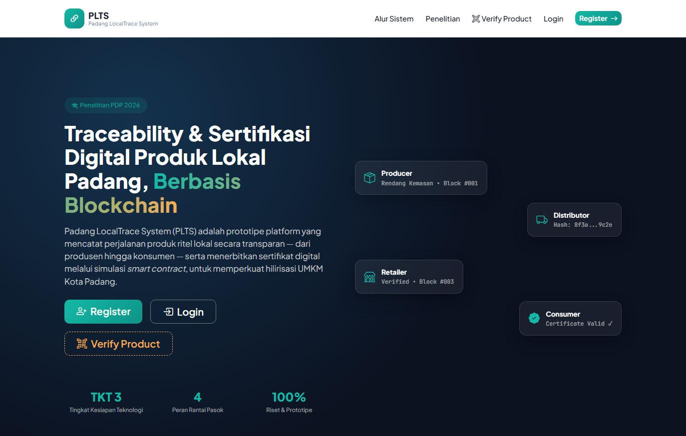
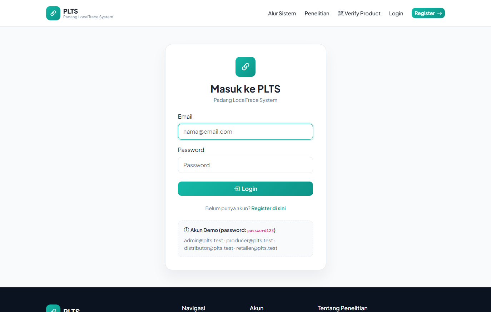
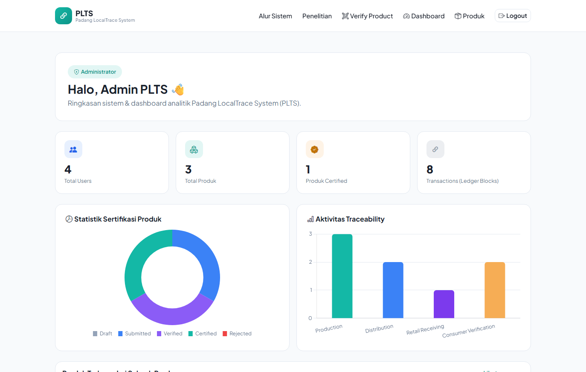
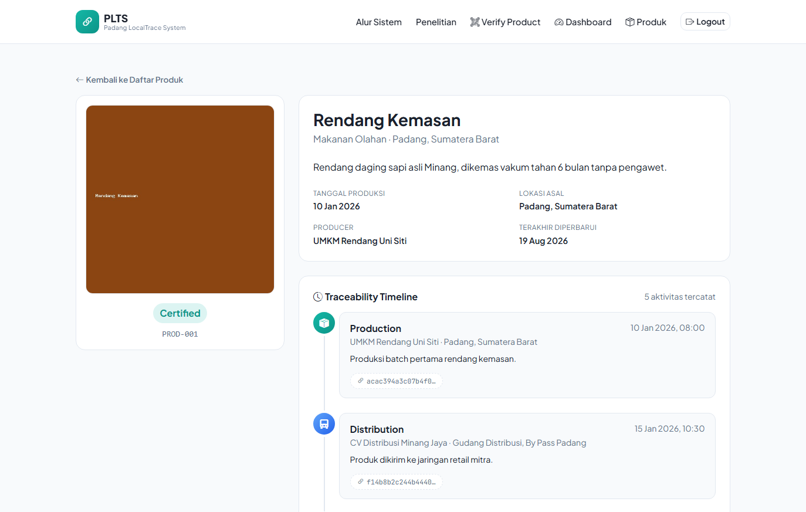
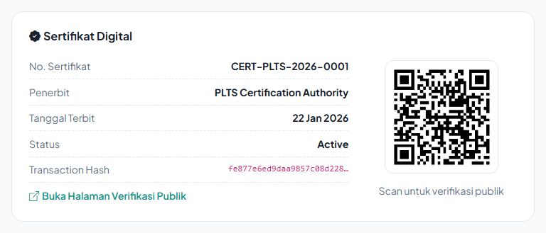
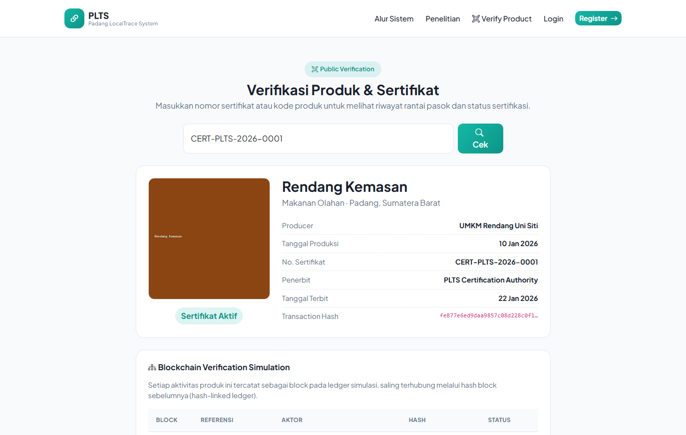

# Padang LocalTrace System (PLTS)

**Blockchain-Based Traceability and Digital Certification Platform for Local Retail Products**

Prototipe penelitian **PDP 2026** — *"Perancangan Sistem Traceability dan Sertifikasi Produk Ritel Lokal Berbasis Blockchain dan Smart Contract untuk Penguatan Hilirisasi di Kota Padang"*.

Sistem ini adalah **prototipe pembuktian konsep (Proof of Concept) pada Tingkat Kesiapterapan Teknologi (TKT) 3** — bukan ERP atau marketplace produksi penuh — yang mendemonstrasikan model *traceability* berbasis konsep blockchain (hash-linked ledger) dan sertifikasi digital berbasis simulasi *smart contract* untuk produk ritel lokal Kota Padang.

---

## Tech Stack

| Layer | Teknologi |
|---|---|
| Backend | PHP Native 8.x (struktur MVC sederhana, tanpa framework) |
| Database | MySQL / MariaDB via PDO (prepared statements) |
| Frontend | Bootstrap 5, Bootstrap Icons, HTML/CSS/JavaScript |
| Chart | Chart.js (CDN) |
| QR Code | qrcode.js (CDN, client-side render) |
| Font | Plus Jakarta Sans & JetBrains Mono (Google Fonts) |

Tidak ada dependency Composer/Node.js/build tool — cukup PHP + MySQL, langsung jalan di localhost maupun shared hosting.

---

## Alur Sistem

```
PRODUCER  →  DISTRIBUTOR  →  RETAILER  →  CONSUMER (Publik)
   │              │               │               │
Production   Distribution   Retail Receiving  Consumer Verification
```

Setiap aktivitas rantai pasok dicatat sebagai **traceability log** yang saling terhubung lewat hash (*hash-linked ledger*), dan direplikasi ke **Blockchain Ledger Simulation** global. Produk yang lengkap dan lolos verifikasi admin diterbitkan **sertifikat digital + QR Code** melalui simulasi *smart contract* (`IF produk_lengkap AND dokumen_valid AND diverifikasi_admin THEN generate_certificate()`).

---

## Cuplikan Layar

| Landing Page | Login |
|---|---|
|  |  |

| Dashboard Admin (Analitik) | Detail Produk & Traceability Timeline |
|---|---|
|  |  |

| Sertifikat Digital & QR Code | Verifikasi Publik |
|---|---|
|  |  |

---

## Fitur Utama

- **Landing page** riset — penjelasan masalah, konsep blockchain/smart contract, alur sistem, info penelitian
- **Autentikasi & role-based dashboard** — Admin, Producer/UMKM, Distributor, Retailer
- **Manajemen produk (CRUD)** dengan upload foto (validasi MIME asli) dan status *Draft → Submitted → Verified → Certified/Rejected*
- **Traceability module** — pencatatan aktivitas rantai pasok dengan hash chaining per produk, ditampilkan sebagai timeline
- **Sertifikasi digital** — simulasi smart contract, checklist kelayakan otomatis, nomor sertifikat unik, QR Code
- **Verifikasi publik** (`/verify.php`) tanpa login — scan QR / input kode, lihat riwayat rantai pasok & status sertifikat, auto-catat aktivitas *Consumer Verification*
- **Dashboard analitik admin** — kartu statistik, grafik sertifikasi & aktivitas traceability, tabel Blockchain Ledger Simulation

---

## Quick Start

```bash
# 1. Import database
mysql -u root < database.sql

# 2. Jalankan (built-in server, tanpa Apache)
php -S localhost:8000
```

Buka `http://localhost:8000/index.php`. Untuk instalasi via XAMPP/hosting, lihat **[INSTALASI.md](INSTALASI.md)**.

### Akun Demo (password: `password123`)

| Role | Email |
|---|---|
| Admin | admin@plts.test |
| Producer / UMKM | producer@plts.test |
| Distributor | distributor@plts.test |
| Retailer | retailer@plts.test |

---

## Struktur Proyek

```
PLB-Padang/
├── config/database.php        # kredensial koneksi database (PDO)
├── core/                      # Database, Auth, helpers, bootstrap (autoload)
├── models/                    # User, Product, TraceabilityLog, Certificate, BlockchainBlock
├── controllers/                # Auth, Product, Traceability, Certification, Verify
├── views/                      # landing, auth, dashboard, products, verify (+ partials)
├── assets/                     # css, js
├── uploads/products/           # foto produk
├── database.sql                # skema lengkap + data contoh
└── index.php, login.php, register.php, dashboard.php,
    products.php, traceability.php, certification.php, verify.php
```

MVC sederhana: setiap file di root berperan sebagai *entry point* yang memanggil Controller, Controller memanggil Model (PDO), lalu me-*render* View. Folder `config/`, `core/`, `models/`, `controllers/`, `views/` diproteksi `.htaccess` dari akses langsung browser.

---

## Dokumentasi

| Dokumen | Isi |
|---|---|
| **[INSTALASI.md](INSTALASI.md)** | Persyaratan sistem, instalasi localhost & hosting, konfigurasi, troubleshooting |
| **[PANDUAN_PENGGUNAAN.md](PANDUAN_PENGGUNAAN.md)** | Panduan pemakaian lengkap per role (Producer, Distributor, Retailer, Admin, Publik), FAQ |

---

## Status Pengembangan

| Fase | Cakupan | Status |
|---|---|---|
| 1 | Database + Authentication + Landing Page | ✅ |
| 2 | Dashboard + Product Management | ✅ |
| 3 | Traceability Module | ✅ |
| 4 | Certification + QR Verification | ✅ |
| 5 | Dashboard Analytics | ✅ |

---

## Catatan Akademik

Proyek ini merupakan luaran **Penelitian Dosen Pemula (PDP) 2026**, disusun sebagai prototipe TKT 3 untuk membuktikan konsep *blockchain-inspired traceability* dan *digital certification* pada produk ritel lokal Kota Padang. Bukan produk komersial — untuk penggunaan produksi diperlukan pengembangan lanjutan (CSRF protection, rate limiting, audit keamanan, dan lain-lain).

---

## Lisensi

Proyek ini dilisensikan di bawah **[MIT License](LICENSE)** — bebas digunakan, dimodifikasi, dan didistribusikan ulang dengan mencantumkan atribusi.
